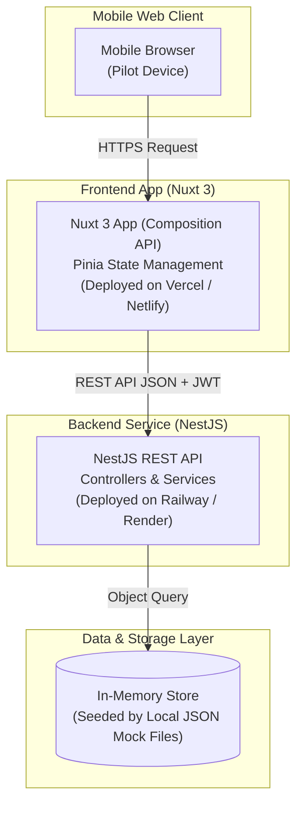
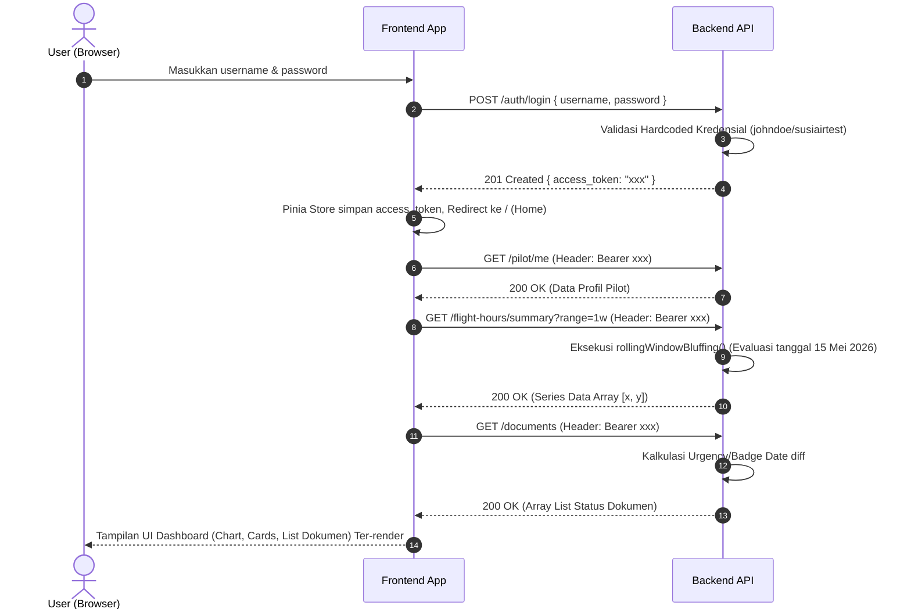

# SYSTEM ARCHITECTURE DOCUMENT

## Susi Air Pilot App (Technical Test)
### API-First Frontend & In-Memory Backend Architecture

| Metadata Dokumen | Nilai |
|------------------|-------|
| **Versi** | 1.0 |
| **Tanggal Terbit** | 2026-10-03 |
| **Pola Arsitektur** | Separated Client/Server (Frontend SPA/SSR - Backend REST API) |
| **Penulis** | Antigravity AI |
| **Status Dokumen** | Draft |

---

## 1. Gambaran Umum Arsitektur (High-Level Architecture)

### 1.1 Deskripsi Gaya Arsitektur
Sistem ini memisahkan secara tegas antara lapisan presentasi/antarmuka (Frontend Mobile Web) dan layanan pusat data serta proses bisnis (Backend API). Frontend dibangun dengan framework Nuxt 3 yang terhubung ke Backend berbasis NestJS. 
Mengingat scope sistem berupa technical test, aplikasi backend tidak menggunakan persistence database seperti SQL (kecuali diputuskan lain), melainkan memanfaatkan pendekatan **In-Memory Store** di mana file-file Mock JSON (`mock-flight-hours.json`, `mock-documents.json`, `mock-schedules.json`) di-load satu kali saat proses inisialisasi server untuk kemudian di-serve ke memori lokal via service singleton NestJS.

### 1.2 Diagram Arsitektur Tingkat Tinggi (Mermaid / Container Diagram)



---

## 2. Katalog Komponen & Tanggung Jawab Layanan

### 2.1 Backend Service (NestJS REST API)
| Aspek | Spesifikasi & Keterangan |
|-------|--------------------------|
| **Tech Stack** | Node.js, NestJS Framework, TypeScript |
| **Domain & Tanggung Jawab** | Melakukan verifikasi otentikasi (JWT AuthGuard), kalkulasi limit dan agregasi rolling sum (komputasi server-side). |
| **Struktur Inti** | Modul terpisah untuk Auth, Pilot, FlightHours, Documents, Schedules. Dilengkapi DTO untuk Request Validation & Global Exception Filter untuk format response error konsisten. |
| **Akses Data** | Membaca object properties dari in-memory arrays. |
| **Daftar Endpoint Utama** | `POST /auth/login`, `GET /pilot/me`, `GET /flight-hours`, `GET /flight-hours/summary`, `GET /documents`, `GET /schedules` |

### 2.2 Frontend (Nuxt 3 App)
| Aspek | Spesifikasi & Keterangan |
|-------|--------------------------|
| **Tech Stack** | Vue 3, Nuxt 3 (Composition API / Script Setup), Pinia, SCSS |
| **Peran Utama** | Rendering layout mobile-first app, handling navigasi antar-halaman (Routing), request ke backend, manajemen state otentikasi (simpan JWT lokal) menggunakan Pinia. |
| **Batasan Arsitektural** | **STRICT: NO HARDCODED MOCK DATA**. Aplikasi Nuxt dilarang membaca json file lokal, melainkan wajib fetching ke URL NestJS Backend. |
| **Komunikasi Keluar** | Menggunakan wrapper composable semacam `useFetch` atau `$fetch` milik Nuxt, dengan menyertakan `Authorization: Bearer <Token>` di headers (kecuali route login). |

---

## 3. Skema & Model Data (In-Memory Database Entities)

### 3.1 Entity Model Interface

```typescript
// 1. Data Mock Penerbangan Harian
interface MockFlightHour {
  date: string; // "2026-05-15"
  hours: number;
}

// 2. Data Dokumen Pilot
interface PilotDocument {
  id: string;
  name: string;
  expiryDate: string; // "2026-05-20"
  thresholdConfig: {
    amberDays: number;
    redDays: number;
  };
}

// 3. Data Roster/Jadwal
interface RosterSchedule {
  id: string;
  date: string; // "YYYY-MM-DD"
  dutyType: 'DUTY' | 'RL' | 'SCK' | 'TR' | 'TX' | 'ADM' | 'FER' | 'MED' | 'REC' | 'UL';
  base_color: string;
  count_logbooks: number;
  count_schedules: number;
}
```

### 3.2 Field Komputasi (Runtime Calculated)
- **Status Warna Dokumen**: Frontend menerima status final dokumen berlabel `safe` / `soon` / `expired` yang telah dievaluasi server dibandingkan terhadap hardcoded 'Hari Ini' (15 Mei 2026).
- **Array Rolling Sum**: Array angka untuk Chart (contoh: 1 week chart terdiri dari array poin Y 7 hari ke belakang, center today, 7 hari ke depan). Agregasi array di generate via function runtime `rollingWindowBluffing()`.

---

## 4. Struktur Internal Service & Desain Layer 

### 4.1 NestJS Flow Layering
```
       HTTP Request dari Nuxt (berisi Auth Token)
             │
             ▼
┌────────────────────────┐
│ Global Auth Guard &    │  ← Pengecekan JWT (jika rute dilindungi)
│ Validation Pipes (DTO) │  ← Pengecekan Query Param Valid (Contoh: date yyyy-mm)
└───────────┬────────────┘
             │
             ▼
┌────────────────────────┐
│   Controller Layer     │  ← Routing Endpoint API (contoh: FlightHoursController)
└───────────┬────────────┘
             │
             ▼
┌────────────────────────┐
│    Service Layer       │  ← pure bisnis logic (Kalkulasi `rollingWindowBluffing()`)
└───────────┬────────────┘
             │
             ▼
┌────────────────────────┐
│   Data Service Layer   │  ← In-Memory Arrays (diisi file json via modul statik load)
└────────────────────────┘
```

### 4.2 Standar Struktur Proyek Repositori
```
/
├── nest/ (Backend)
│   ├── src/
│   │   ├── auth/              -> AuthController, AuthService
│   │   ├── pilot/             -> PilotController, PilotService
│   │   ├── flight-hours/      -> FlightHoursController, FlightHoursService
│   │   ├── documents/         -> DocumentsController, DocumentsService
│   │   ├── schedules/         -> SchedulesController, SchedulesService
│   │   ├── common/            -> GlobalExceptionFilter, JwtGuard
│   │   ├── db/                -> In-memory seeder / JSON reader
│   │   ├── main.ts            -> Bootstrapper Server
│   │   └── app.module.ts
│   └── data/                  -> mock-flight-hours.json dll.
│
├── nuxt/ (Frontend)
│   ├── assets/                -> scss/main.scss, fonts/
│   ├── components/            -> Header, DutyCard, LineChart, Badge, BottomNav, Calendar
│   ├── composables/           -> useApi.ts (Fetch wrapper injects token)
│   ├── pages/
│   │   ├── index.vue          -> Home page
│   │   ├── login.vue          -> Sign In page
│   │   └── schedule.vue       -> Roster Calendar page
│   ├── stores/                -> auth.ts, user.ts (Pinia)
│   ├── app.vue
│   └── nuxt.config.ts         -> Environment Variable config backend URL
```

---

## 5. Alur Komunikasi Antar Layanan (Sequence Flows)

### 5.1 Alur Autentikasi dan Akses Dashboard (Login -> Home)



---

## 6. Keputusan Desain & Arsitektur (Architecture Decision Records / ADR)

### ADR-01: Penyimpanan Data menggunakan In-Memory Data Store (Singleton Service)
- **Konteks**: Brief test mengharuskan memuat 3 file JSON di awal, tanpa kewajiban ORM database sungguhan.
- **Keputusan**: Backend NestJS akan membaca JSON secara sinkron saat `OnModuleInit` (startup boot) dan menyimpannya ke dalam variable constant atau service scope 'Singleton' agar bisa dipanggil semua endpoint secara instan dalam memori.
- **Alasan & Trade-Off**: Menghindari overengineering menggunakan SQLite/TypeORM yang membutuhkan overhead setup tabel dan migrations untuk sekadar mengonsumsi data *mock*. Hal ini berisiko state restart hilang, tetapi 100% *compliant* dengan objektif technical test.

### ADR-02: Isolasi 'Hari Ini' via Dependensi Injection / Konstanta
- **Konteks**: Algoritma kalkulasi grafik dan schedule mensyaratkan berpatokan ke tanggal absolut 15 Mei 2026.
- **Keputusan**: Semua fungsi yang membutuhkan "new Date() / hari ini", akan merujuk pada sebuah helper method / constant variable (misal: `const APP_TODAY = '2026-05-15'`), diseragamkan di front-end (jika butuh state navigasi bulan default) dan terutama di back-end.
- **Alasan & Trade-Off**: Tanpa hardcode, fungsi rolling sum akan patah saat tim *reviewer* / penilai membuka aplikasi di tahun yang berbeda (misalnya saat pengecekan test di bulan Juni 2026, logic dokumen expired akan error).

### ADR-03: Delegasi Kalkulasi Kompleks ke Server (Thin Client)
- **Konteks**: UI menampilkan rolling sum chart dan status kadaluarsa.
- **Keputusan**: Framework Nuxt (Frontend) bersifat *dumb component*. Semua output endpoint dari NestJS wajib sudah berupa data bersih matang (*computed fields*), tidak ada agregasi data dari raw objects dilakukan di halaman vue. 
- **Alasan & Trade-Off**: Memenuhi instruksi mutlak test ("rolling sum runs on the server"), mempermudah rendering component grafik, sekaligus meringankan *processing* handphone user.
